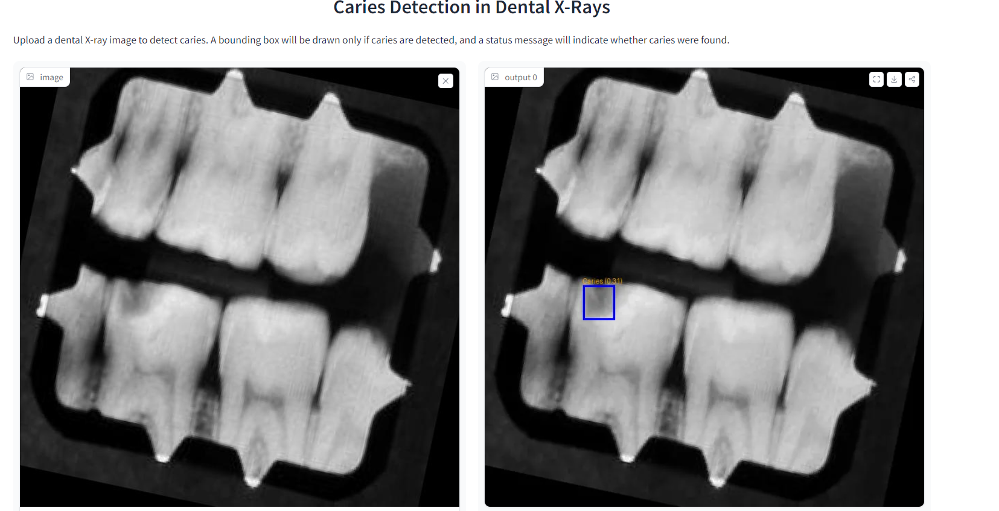

# 🦷 Tooth Caries Detection Using AI 🦷

Welcome to the Caries Detection project! This project leverages machine learning and computer vision to assist dentists in diagnosing tooth cavities (caries) using dental x-ray images. The model is designed to help localizie the extent of tooth decay and, in future versions, provide more precise segmentation of affected areas.

🌐 [Try the Deployed App on Hugging Face](https://sabagul-caries-detection-from-x-rays.hf.space)



## 🚀 Project Overview

### Motivation
This project was inspired by a personal experience where multiple dental opinions were needed to make the right decision regarding a tooth cavity. My goal is to provide a tool that assists dentists in making better, data-driven decisions through the use of AI and collective wisdom. This AI model helps analyze dental x-rays, identifying potential cavities and evaluating the extent of decay.

The next phase of development will focus on segmenting the affected areas to better assess the extent of the damage, providing more detailed information to assist in treatment planning.

### Features
- **Caries Detection:** Initial version detects the presence of caries (tooth decay) from dental x-rays.
- **AI-Assisted Diagnosis:** Provides an AI-based recommendation to assist dentists in evaluating the tooth condition.
- **Future Development (Coming Soon!):** The next step is to introduce a segmentation feature to gauge the extent of the rot and help determine the best course of action (e.g., root canal treatment vs extraction).

## 🛠 Tech Stack
- **Python**: Main language used for the project.
- **Ultralytics YOLO**: For caries detection from x-ray images.
- **OpenCV**: For image processing.
- **Gradio**: To create a simple and intuitive web interface for the app.
- **Docker**: To containerize the application.

## 📂 Project Structure
```
├── app/
│   ├── gradio-app.py      # Main file to launch the Gradio web app
│   ├── model.py           # Model loading and prediction logic
│   ├── predict.py         # Functions for handling predictions
├── data/
│   ├── best.pt            # Pre-trained YOLO model for detecting caries
├── requirements.txt       # Python dependencies
├── Dockerfile             # Docker configuration file
└── README.md              # Project documentation
```

## 🖥 How to Run

1. **Clone the repository**:
   ```bash
   git clone https://github.com/yourusername/caries-detection.git
   cd caries-detection
   ```

2. **Install dependencies**:
   Make sure you have Python 3.10 or higher installed, then run:
   ```bash
   pip install -r requirements.txt
   ```

3. **Run the Gradio app**:
   ```bash
   python app/gradio-app.py
   ```

4. **Docker (Optional)**:
   If you'd prefer to run the app using Docker, simply:
   ```bash
   docker build -t caries-detection-app .
   docker run -p 7860:7860 caries-detection-app
   ```

5. **Access the app**:
   Open your browser and go to `http://localhost:7860` to interact with the AI-powered caries detection tool!

## 📝 Future Work
- **Segmentation of caries**: The next step is to segment the decayed portion of the tooth to help dentists assess the extent of the damage.
- **Model improvements**: Continue training the model to improve accuracy and expand the dataset.
- **Refinement of the Gradio UI**: Enhance the user interface to provide more interactive and user-friendly features.

## 👩‍💻 Contributions
Contributions are welcome! Feel free to fork this repository and submit a pull request with improvements, bug fixes, or new features.


