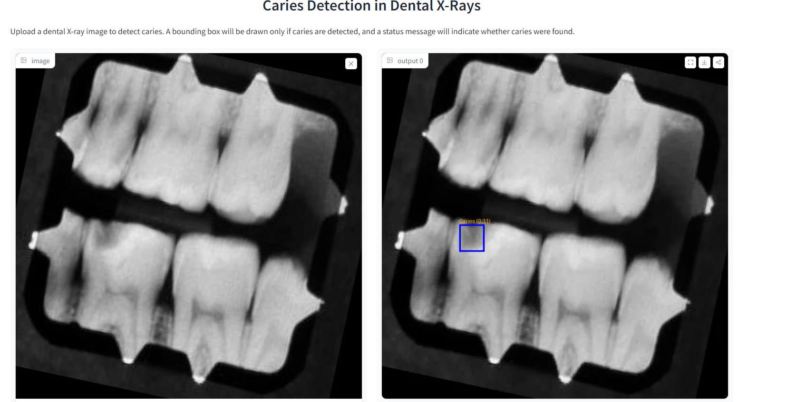

# 🦷 基于AI的牙齿龋病检测 🦷

欢迎来到龋病检测项目！本项目利用机器学习和计算机视觉技术帮助牙医诊断牙齿蛀牙（龋病），通过分析牙科X光图像实现诊断。该模型旨在帮助定位牙齿蛀蚀的范围，在未来版本中，将提供受影响区域的更精确分割。

🌐 [在Hugging Face上试用部署的应用](https://sabagul-caries-detection-from-x-rays.hf.space)



## 🚀 项目概述

### 项目动机
本项目的灵感来源于一次个人经历，当时需要多位牙医的意见才能对牙齿蛀牙做出正确的治疗决定。我的目标是提供一个工具，通过使用AI和集体智慧帮助牙医做出更好的、基于数据的决策。这个AI模型帮助分析牙科X光片，识别潜在的蛀牙并评估蛀蚀程度。

下一阶段的开发将专注于分割受影响的区域，以更好地评估损坏程度，为治疗计划提供更详细的信息。

### 功能特性
- **龋病检测：** 初始版本从牙科X光片检测龋病（牙齿蛀蚀）的存在。
- **AI辅助诊断：** 提供基于AI的建议，协助牙医评估牙齿状况。
- **未来开发（即将推出！）：** 下一步是引入分割功能，以评估蛀蚀程度，帮助确定最佳治疗方案（例如，根管治疗vs拔牙）。

## 🛠 技术栈
- **Python**: 项目使用的主要编程语言。
- **Ultralytics YOLO**: 用于从X光图像检测龋病。
- **OpenCV**: 用于图像处理。
- **Gradio**: 创建简单直观的Web界面。
- **Docker**: 容器化应用程序。

## 📂 项目结构
```
├── app/
│   ├── gradio-app.py      # 启动Gradio Web应用的主文件
│   ├── model.py           # 模型加载和预测逻辑
│   ├── predict.py         # 处理预测的函数
├── data/
│   ├── best.pt            # 用于检测龋病的预训练YOLO模型
├── requirements.txt       # Python依赖项
├── Dockerfile             # Docker配置文件
└── README.md              # 项目文档
```

## 🖥 如何运行

1. **克隆仓库**:
   ```bash
   git clone https://github.com/MybcyQzqxw/Caries-Detection-In-Dental-X-Rays-Using-Computer-Vision.git
   cd Caries-Detection-In-Dental-X-Rays-Using-Computer-Vision
   ```

2. **创建环境并安装依赖**:
   ```bash
   conda create -n caries-detection python=3.10 -y
   conda activate caries-detection
   pip install -r Caries-Detection/requirements.txt
   ```

3. **运行Gradio应用**:
   ```bash
   python Caries-Detection/app/gradio-app.py
   ```

4. **访问应用**:
   打开浏览器并访问 `http://localhost:7860` 与AI驱动的龋病检测工具进行交互！

## 🔧 故障排除

### 常见问题

1. **模型文件路径错误**
   ```
   FileNotFoundError: [Errno 2] No such file or directory: '/app/data/best.pt'
   ```
   **解决方案**: 确保您在项目根目录运行应用，并且模型文件存在于 `Caries-Detection/data/best.pt`

2. **Python环境问题**
   ```
   找不到命令 "python"
   ```
   **解决方案**: 使用 `python3` 或激活conda环境后再运行

3. **依赖包缺失**
   ```
   ModuleNotFoundError: No module named 'ultralytics'
   ```
   **解决方案**: 确保激活了正确的conda环境并安装了所有依赖：
   ```bash
   conda activate caries-detection
   pip install -r Caries-Detection/requirements.txt
   ```

## 📝 未来工作
- **龋病分割**: 下一步是分割牙齿的蛀蚀部分，以帮助牙医评估损坏程度。
- **模型改进**: 继续训练模型以提高准确性并扩展数据集。
- **Gradio UI优化**: 增强用户界面，提供更多交互性和用户友好的功能。

## 👩‍💻 贡献
欢迎贡献！请随时fork此仓库并提交包含改进、错误修复或新功能的pull request。

## 📄 许可证
本项目遵循 MIT 许可证。详情请参阅 [LICENSE](LICENSE) 文件。

## 🤝 支持
如果您觉得这个项目有用，请给它一个 ⭐️！

如果您有任何问题或建议，请随时提出issue或联系我们。

---

**注意**: 此工具仅用于辅助诊断目的。任何治疗决定都应由合格的牙科专业人员做出。

## 🌍 多语言支持
- [English](README.md)
- [中文](README.zh-CN.md)
